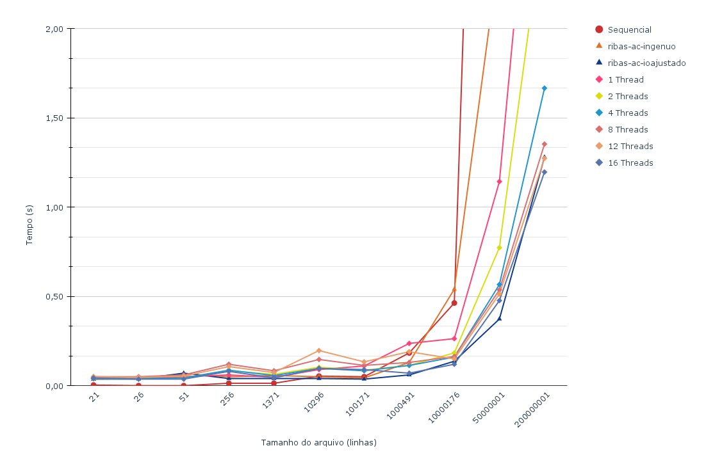

# Relatório

## Membros da Equipe

  * Gabriela Medeiros da Silva - 16/0121817
  * Geovana Ramos Sousa Silva - 16/0122180
  * Guilherme Guy de Andrade - 16/0123186


## Experimentos e tentativas da equipe

A primeira versão sequencial (*ursal_lista.c*) tentou utilizar listas alocadas dinamicamente, mas a alocação de recursos adicionava demora ao codigo. Essa versão evoluiu para uma versão que utiliza uma array pré-alocada (*ursal_array.c*) para contabilizar os resultados. O tamanho dessa array é fixo pois há um número limitado de candidatos. Essa versão lê as entradas do *STDIN* por meio da função *scanf* de forma sequencial e, após a leitura, computa o resultado.

Para a versão paralela (*ursal_paralelo.c*) foi utilizada estratégia de paralelismo na leitura dos dados, de forma que é carregado o arquivo inteiro na memória e as threads se tornam responsáveis por diferentes áreas do arquivo. Isso é feito obtendo o tamanho total de *bytes* do arquivo e dividindo pela quantidade de *threads*, considerando o espaço da primeira linha, que contém informações gerais.

Quando uma *thread* inicia sua leitura, ela continua a ler até encontrar um marcador *\n* para indicar o fim de uma linha. Só após encontrar esse marcador a leitura é iniciada. Ou seja, caso a *thread* comece a leitura na metade de uma linha ela avança para a linha seguinte no arquivo, já que essa linha será de responsabilidade da *thread* anterior. Como todas as *threads* repetem este comportamento, não há linha computada mais de uma vez.

## Informações sobre as regiões críticas de paralelização

A região paralelizada do código é a seguinte:

```c
  // ursal_paralelo.c

    #pragma omp parallel for private(voto) shared(votos) reduction(+:total_geral) reduction(+:total_invalidos)
    for (int byte = byte_atual; byte < leitura; byte++) {
        // quando as threads iniciam no meio de um número, passa pro proximo e deixa o numero para a thread anterior
        if (buffer[byte - 1] != '\n') {
            continue;
        }

        // quando estiver no primeiro digito de um numero, o atoi irá ler até o \n
        // na proxima iteracao o while pula o numero que foi lido ate o \n para ler o proximo
        voto = atoi(&buffer[byte]);
        if (voto < 0) {
            total_invalidos++;
        } else if (voto > 0) {
            #pragma omp atomic
            votos[voto]++;

            total_geral++;
        }
        // voto == 0 é quando se faz atoi(EOF)
    }
```

Nesta região são utilizadas duas diretivas do *OMP*. Elas são utilizadas da seguinte forma:

```c
    #pragma omp parallel for private(voto) shared(votos) reduction(+:total_geral) reduction(+:total_invalidos)
```

A primeira diretiva define uma região paralela que executará duas reduções de soma, uma para o total de votos e outra para contabilizar os votos inválidos. Além disso é definida a variável *voto* como privada para cada *thread* e *votos* como compartilhada entre eles.

```c
    #pragma omp atomic
    votos[voto]++;
```

Como *votos* é compartilhada entre as *threads*, a escrita de dados deve ser feita por apenas uma *thread* por vez. Por isso é utilizada a diretiva *atomic*.

### Teste de desempenho

Os testes foram realizados no cluster *Chococino*, na máquina CM2. Cada um dos testes foi executado três vezes, para cada arquivo de entrada, sendo o tempo final a média do tempo de execução.

A seguinte tabela compara o tempo médio das soluções de acordo com a entrada:

| Entrada        | Número de Linhas | Sequencial | ribas-ac-ingenuo | ribas-ac-ajustado | 1 Thread | 2 Threads | 4 Threads | 8 Threads | 12 Threads | 16 Threads |
| -------------- | ---------------- | ---------- | ---------------- | ----------------- | -------- | --------- | --------- | --------- | ---------- | ---------- |
| file001-sample | 21               | **0,00**   | 0,04             | 0,04              | 0,04     | 0,04      | 0,04      | *0,05*    | *0,05*     | 0,04       |
| file009        | 26               | **0,00**   | 0,04             | 0,04              | 0,04     | 0,04      | 0,04      | *0,05*    | *0,05*     | 0,04       |
| file002-sample | 51               | **0,00**   | *0,07*           | *0,07*            | 0,05     | 0,04      | 0,04      | 0,06      | 0,05       | 0,04       |
| file003        | 256              | **0,01**   | 0,05             | 0,04              | 0,06     | 0,08      | 0,09      | *0,12*    | 0,11       | 0,08       |
| file004        | 1371             | **0,01**   | 0,06             | 0,04              | 0,05     | 0,06      | 0,06      | *0,08*    | 0,07       | 0,04       |
| file005-sample | 10296            | 0,05       | 0,05             | **0,04**          | 0,09     | 0,10      | 0,10      | 0,15      | *0,20*     | 0,10       |
| file006        | 100171           | 0,05       | **0,04**         | **0,04**          | 0,11     | 0,09      | 0,08      | 0,11      | *0,13*     | 0,09       |
| file007-sample | 1000491          | 0,18       | 0,13             | **0,06**          | *0,24*   | 0,11      | 0,11      | 0,13      | 0,19       | 0,07       |
| file008        | 10000176         | 0,46       | *0,54*           | 0,14              | 0,26     | 0,18      | 0,16      | 0,16      | 0,15       | **0,12**   |
| file010-big    | 50000001         | *8,16*     | 2,44             | **0,37**          | 1,14     | 0,77      | 0,57      | 0,54      | 0,51       | 0,48       |
| file-011-big   | 200000001        | *32,11*    | 9,40             | 1,28              | 3,86     | 2,66      | 1,67      | 1,35      | 1,27       | **1,20**   |

> [Fonte dos dados](https://docs.google.com/spreadsheets/d/e/2PACX-1vRq1nuJRUqMmV2D0_mPMxHVD7dH3h2R1TRSDPhrpmYdfp-eEjq3NbD8-Fwg7vyM2KGGf2RuwSysfSy7/pubhtml)

O resultado com menor tempo para cada arquivo está em destaque com **negrito** e o pior resultado em *itálico*.

Para entradas pequenas (0 até 1371 linhas), a versão sequencial sempre obteve o melhor resultado. Ganhando, inclusive, da versão de 1 *Thread*. Isso se deve ao *overhead* que as *threads* acrescentam ao código.

Entretanto, para entradas maiores a versão sequencial começa a mostrar suas limitações e para entradas maiores que 50000001 linhas ela é a mais demorada por uma grande margem.

* Gráficos com os tempos das diversas soluções



> [Versão interativa](https://docs.google.com/spreadsheets/d/e/2PACX-1vRq1nuJRUqMmV2D0_mPMxHVD7dH3h2R1TRSDPhrpmYdfp-eEjq3NbD8-Fwg7vyM2KGGf2RuwSysfSy7/pubchart?oid=1733279557&format=interactive)
